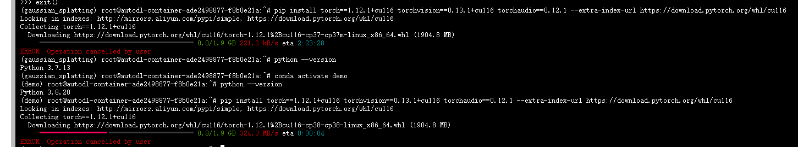

# Linux系统
## 临时代理设置
```bash
export http_proxy="http://127.0.0.1:10809"
export https_proxy="http://127.0.0.1:10809" 注意两个都是http
```
## 取消临时代理
```bash
unset http_proxy
unset https_proxy
```
## 永久设置代理
```bash
vim /etc/profile：
    export http_proxy='http://127.0.0.1:10809'
    export https_proxy='http://127.0.0.1:10809'
source /etc/profile
```
## 查看当前代理
```
env | grep -i proxy
```
## miniconda的安装

1.将`Miniconda3-latest-Linux-x86_64.sh`下载到`/opt/`路径
```bash
wget https://repo.anaconda.com/miniconda/Miniconda3-latest-Linux-x86_64.sh
```
2.安装Miniconda
执行以下命令进行安装，并按照提示操作，直到安装完成。
```bash
bash Miniconda3-latest-Linux-x86_64.sh
```
3.如果你不希望在启动时自动激活 conda 的基础环境，你可以设置 auto_activate_base 参数为 false。
```bash
conda config --set auto_activate_base false
```
4.设置conda的镜像源
查看镜像
```bash
conda config --show channels
```
设置镜像
```bash
#包含了一些基本的 Python 包、库和工具。
conda config --add channels https://mirrors.tuna.tsinghua.edu.cn/anaconda/pkgs/free/

#这是 Anaconda 主要的通道，包含了大量的 Python 包和工具。如果你主要使用 Python 包，这是一个必要的通道。
conda config --add channels https://mirrors.tuna.tsinghua.edu.cn/anaconda/pkgs/main/

#Conda Forge 是社区驱动的通道，包含了许多额外的 Python 包和工具。
conda config --add channels https://mirrors.tuna.tsinghua.edu.cn/anaconda/cloud/conda-forge/

conda config --set show_channel_urls yes
```

## Autodl的加速方法

**学术加速**
```
#设置加速
source /etc/network_turbo
#取消加速
unset http_proxy && unset https_proxy
```

⚡**注意：autodl有一个坑。尽量使用3.8版本的python，如果一个版本pytorch安装不了可能是因为链接本身的原因，更换一下虚拟环境的python版本，安装不同版本的pytorch**
# Windows系统
## 给pip设置代理
在C:\User\用户目录下，新建pip文件夹，然后在该文件夹下新建pip.ini文件。填写如下内容：
```
[global]
index-url = https://pypi.tuna.tsinghua.edu.cn/simple
proxy     = http://127.0.0.1:10809
[install]
trusted-host=pypi.tuna.tsinghua.edu.cn
```
## pip设置镜像源

**临时使用**
```
pip install -i https://pypi.tuna.tsinghua.edu.cn/simple some-package
```
注意，simple 不能少, 是 https 而不是 http

**设为默认**
升级 pip 到最新的版本 (>=10.0.0) 后进行配置：
```
python -m pip install --upgrade pip
pip config set global.index-url https://pypi.tuna.tsinghua.edu.cn/simple
```
如果您到 pip 默认源的网络连接较差，临时使用本镜像站来升级 pip：
```
python -m pip install -i https://pypi.tuna.tsinghua.edu.cn/simple --upgrade 
```
**配置多个镜像源**
如果您想配置多个镜像源平衡负载，可在已经替换 index-url 的情况下通过以下方式继续增加源站：
```
pip config set global.extra-index-url "<url1> <url2>..."
```
## 删除源

`pip config unset global.index-url
`
## 查看pip镜像源
```
pip config list
```
**这个镜像源下载很快，可以不给conda设置镜像源，给pip设置镜像源即可**
