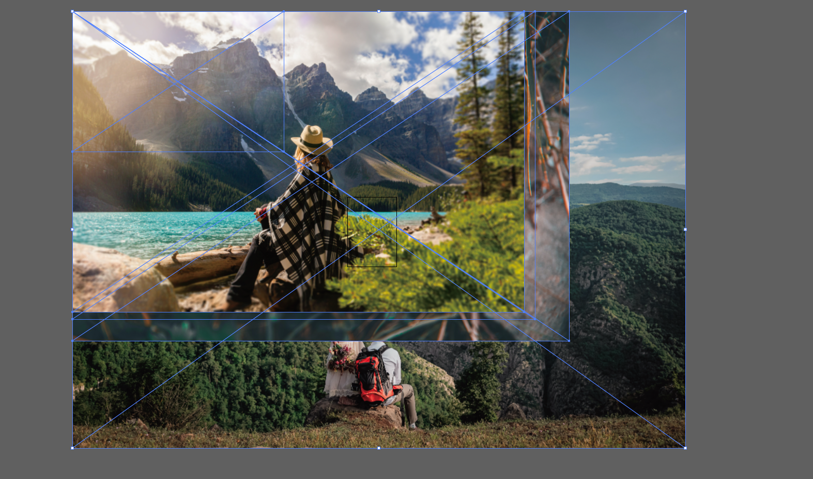
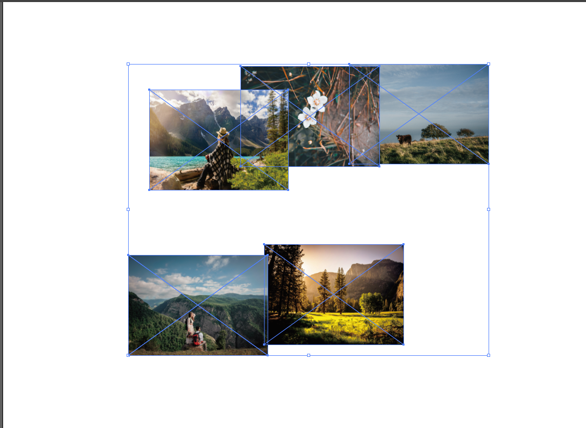
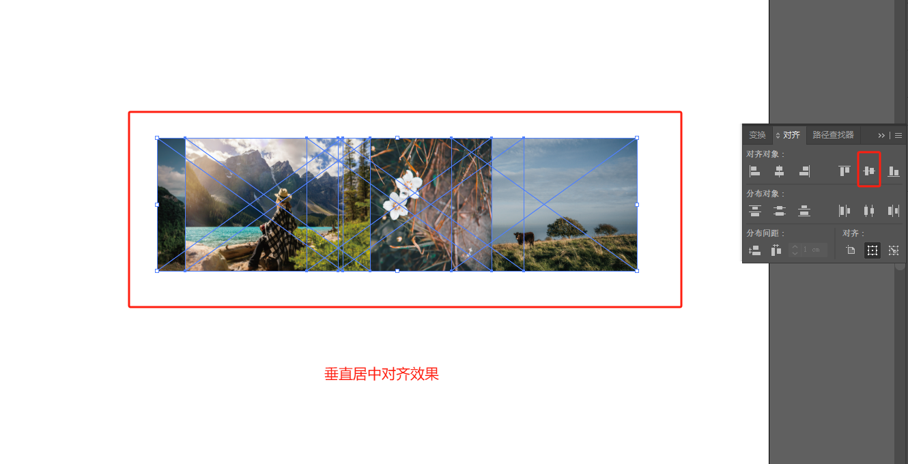
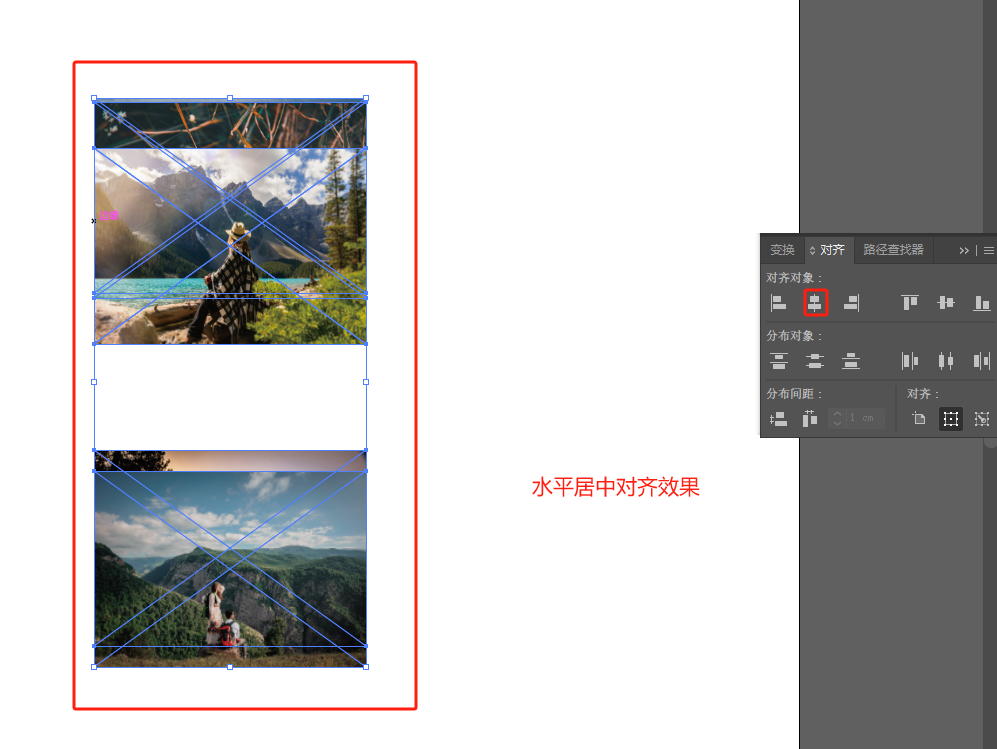
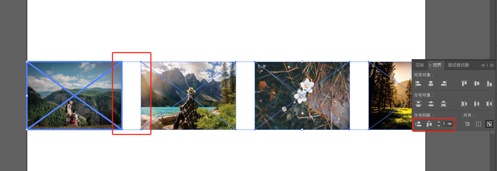
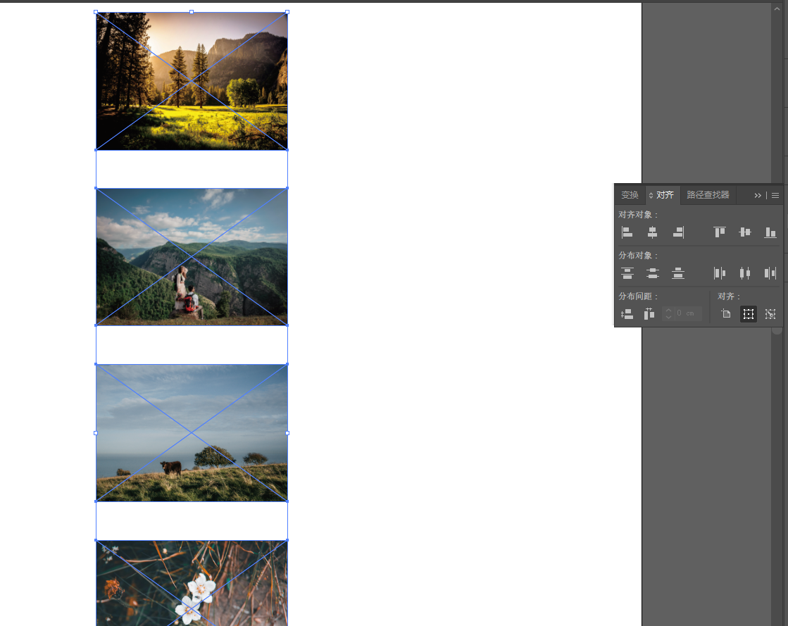

# AI[^1]使用方法
## 使用AI组图
### 首先导入一组图片
1. 新建画板，A4大小。画板大小仅用于判断图片和文字大小， 在导出的时候可以选择是否使用画板，如果不使用画板就是仅导出所有元素的边框大小。
2. 导入方法，使用`Ctrl+C`和`Ctrl+V`复制粘贴
3. 粘贴后进入图像后如下图所示
4. 这时候不要乱动，**修改宽和高**，取消比例锁定
5. 全选，然后点击要对齐的对象，点击垂直居中对齐，就是在同一条水平线上，效果如下
6. 如果点击的是水平居中对齐，就是一条竖线。
7. 点击要对齐的对象，点击水平分布间距，设置水平间距。这里设置1厘米。
8. 或者点击垂直分布
9. 然后点击导出为TIFF格式，可以选择分辨率
10. 储存为AI格式，这样AI格式文件和TIFF格式文件各一个便于修改。
## 绘制箭头和矩形边框
### 箭头
点击直线工具，设置描边，粗细颜色等参数。
### 矩形
点击矩形，设置填充为空白，描边设置颜色、像素、虚线间距等参数。
# Origin绘图技巧
## 待更新
[^1]:Adobe Illustrator